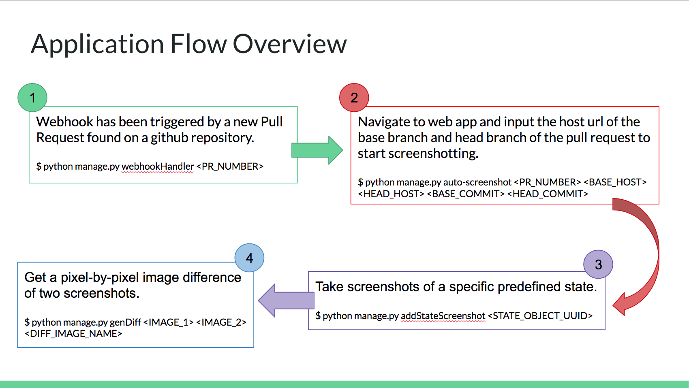

# Auto-Screenshots

Generates perceptual diff of a git repository as you make pull requests.

## Installation

### Manual Installation

**System Requirements**

Download and install the following:

* [Python 2](https://www.python.org/downloads/) w/ pip installed
* [Node](https://nodejs.org/en/) w/ yarn installed
* [Redis](https://redis.io/)
* [PostgreSQL](https://www.postgresql.org/)
* [PhantomJS](http://phantomjs.org/)

Create databases:

Run `psql postgres` to open the [interactive terminal](https://www.postgresql.org/docs/9.2/static/app-psql.html). Then run these commands:

```postgres
CREATE DATABASE garnish_db;
CREATE USER garnish_user WITH LOGIN PASSWORD 'garnish';
```

This will create a new database and user used by the app.


**Python and NodeJs Packages**

```
$ pip install -r requirements.txt
$ yarn install
```

### Docker Installation
Make sure to set up PostgreSQL:
```postgres
CREATE DATABASE garnish_db
CREATE USER garnish_user WITH LOGIN PASSWORD 'garnish'
```

Run Docker:
```
docker run build . -t <IMAGE_ORG>/<IMAGE_NAME>:<IMAGE_TAG>
docker run -it <JUST_GENERATED_DOCKER_BUILD_HASH> bash
```

## Setup
There are 3 testing configurations I will cover in this setup:
1. Production, which is the live hosted environment,
2. VM replica of Production for testing how deployment configuration may operate in production
3. Local Development for basic application without production in mind.

### Environment Variables
*You may create a file named `HookCatcher/HookCatcher/user_settings.py` in the same directory as `manage.py` that instantiates all these envionment variables as normal python strings.*

**Define the following environment variables**

```
GIT_REPO='YOUR_GITHUB_USERNAME/YOUR_GITHUB_REPO'
```

Your Github [personal access token](https://help.github.com/articles/creating-a-personal-access-token-for-the-command-line/):
```
GIT_OAUTH='YOU_AUTH_ID_HERE'
```

The name of the directory in the Git Repository that stores the state representation JSON files. See [this folder](https://github.com/MingDai/kolibri/tree/test-master/states) for example:
```
STATES_FOLDER='NAME_OF_YOUR_STATES_FOLDER'
```

Set what screen capture tools and resolutions you want. Add the screenshot configuration file to root of this directory. See [this file](https://github.com/MingDai/HookCatcher/blob/develop/HookCatcher/config.json) for example:
```
SCREENSHOT_CONFIG='PATH_TO_YOUR_CONFIG_FILE'
```

Specify the port that is running Redis (defaults to 6379):
```
REDIS_PORT='REDIS_PORT_NUMBER'
```

Specify the port that is running PostgreSQL (defaults to 5432):
```
POSTGRES_PORT='POSTGRES_PORT_NUMBER'
```

### Production:

##### Download Kubernetes and Helm
`$ brew install kubernetes-cli`
`$ brew install kubernetes-helm`

##### Initiate Helm
`$ helm init`

##### Connect to your clusters and use kubectl command line access by running the following command:
`gcloud container clusters get-credentials health-inspector --zone us-central1-f --project health-inspector-182716`

###### NOTE this command can be found by (Needs health-inspector project permission)
1. Logging into console.cloud.google.com, go to Health Inspector project
2. Click "Kubernetes Engine" on the left hand dropdown menu
3. Click "Kubernetes clusters" (should be default)
4. Select "health-inspector" under the Kubernetes clusters list
5. Click the "Connect" button on the top
6. You should be prompted with a gcloud command line command

#### Configure the s3 bucket:
##### in `HookCatcher/HookCatcher/HookCatcherProj/settings.py`
Add `storages` to your INSTALLED_APPS
```
INSTALLED_APPS = (
    ...
    'storages',
    ...
)
```

Define these variables to your `settings.py` file:
```
# Leverage object file storage in s3 bucket
DEFAULT_FILE_STORAGE = 'storages.backends.s3boto3.S3Boto3Storage'

AWS_ACCESS_KEY_ID = os.getenv('AWS_ACCESS_KEY_ID')
AWS_SECRET_ACCESS_KEY = os.getenv('AWS_SECRET_ACCESS_KEY')
AWS_STORAGE_BUCKET_NAME = os.getenv('AWS_STORAGE_BUCKET_NAME')
AWS_S3_ENDPOINT_URL = os.getenv('AWS_S3_ENDPOINT_URL')
```

##### in `HookCatcher/chart/hookcatcher/values.yaml`
Create the following tags:
```
s3:
  AWS_ACCESS_KEY_ID: <SECRET_READ_BELOW>
  AWS_SECRET_ACCESS_KEY: <SECRET_READ_BELOW>
  AWS_STORAGE_BUCKET_NAME: "health-inspector"
  AWS_S3_ENDPOINT_URL: "https://storage.googleapis.com"
```
To find the values of AWS_ACCESS_KEY_ID and AWS_SECRET_ACCESS_KEY,
1. Logging into console.cloud.google.com, go to Health Inspector project
2. Click "Storage" on the left hand dropdown menu
3. Click "Settings" (NOT default)
4. Select "Interoperability" from the tabs on top
5. Click the "Create a new key" button at the bottom
6. Copy the Access Key to "AWS_ACCESS_KEY_ID" and Secret to "AWS_SECRET_ACCESS_KEY"

###### IMPORTANT: NEVER CHECK S3 SECRETS TO GITHUB OR SHARE WITH ANYONE

#### When you wish to publish a change to production:

##### 1. Edit the values under the image: tag in /chart/hookcatcher/values.yaml to name of the docker build:
```
org: <IMAGE_ORG>
name: <IMAGE_NAME>
tag: <IMAGE_TAG>
```

##### 2. Build a new Docker image:
`$docker run build . -t <IMAGE_ORG>/<IMAGE_NAME>:<IMAGE_TAG>`

##### 3. Publish this new Docker image:
`$docker push <IMAGE_ORG>/<IMAGE_NAME>:<IMAGE_TAG>`

##### 4. Update all your pods
`$ helm upgrade --install <PATH_TO_DIRECTORYOF_CHART.YAML> <NAME_OF_DEPLOYMENT> --debug`

##### 5. Check live status of the pods
`$ kubectl get pods`
When all these pods are ready 1/1 then they are all healthy and ready to go. Congrats!

##### 6. Your updates should be visible at the url from the address column of the following command:
`$ kubectl get ing`

#### Debugging:
##### If there are pods with status = Pending or a large number of restarts
Try checking the logs of the pod:
`$ kubectl logs --follow=true <POD_NAME>`

##### If you want to check ENV variables try:
`$ kubectl describe pod <POD_NAME>`

##### You may also SSH into any pod any test the environment any way you like for yourself:
`$ kubectl exec -it <POD_NAME> bash`


### Local Virtual Machine Replica of Production:

##### Installation
GOTO this [link](https://kubernetes.io/docs/tasks/tools/install-minikube/) for instructions on downloading a VM and minikube

##### Start and configure your Virtual Machine with minikube
`$ minikube start`
`$ eval $(minikube docker-env)`

##### Initiate Helm
`$ helm init`

#### Configure the s3 bucket:
##### in `HookCatcher/HookCatcher/HookCatcherProj/settings.py`
Add `storages` to your INSTALLED_APPS
```
INSTALLED_APPS = (
    ...
    'storages',
    ...
)
```

Define these variables to your `settings.py` file:
```
# Leverage object file storage in s3 bucket
DEFAULT_FILE_STORAGE = 'storages.backends.s3boto3.S3Boto3Storage'

AWS_ACCESS_KEY_ID = os.getenv('AWS_ACCESS_KEY_ID')
AWS_SECRET_ACCESS_KEY = os.getenv('AWS_SECRET_ACCESS_KEY')
AWS_STORAGE_BUCKET_NAME = os.getenv('AWS_STORAGE_BUCKET_NAME')
AWS_S3_ENDPOINT_URL = os.getenv('AWS_S3_ENDPOINT_URL')
```

##### in `HookCatcher/chart/hookcatcher/values.yaml`
Create the following tags:
```
s3:
  AWS_ACCESS_KEY_ID:
  AWS_SECRET_ACCESS_KEY:
  AWS_STORAGE_BUCKET_NAME: "health-inspector"
  AWS_S3_ENDPOINT_URL: "https://storage.googleapis.com"
```
To find the values of `AWS_ACCESS_KEY_ID` and `AWS_SECRET_ACCESS_KEY`,
1. Logging into console.cloud.google.com, go to Health Inspector project
2. Click "Storage" on the left hand dropdown menu
3. Click "Settings" (NOT default)
4. Select "Interoperability" from the tabs on top
5. Click the "Create a new key" button at the bottom
6. Copy the Access Key to `AWS_ACCESS_KEY_ID` and Secret to`AWS_SECRET_ACCESS_KEY`

###### IMPORTANT: NEVER CHECK S3 SECRETS TO GITHUB OR SHARE WITH ANYONE

#### When you wish to publish a change:

#### Edit the values under the image: tag in the /chart/hookcatcher/values.yaml to name of the docker build:
```
org: <IMAGE_ORG>
name: <IMAGE_NAME>
tag: <IMAGE_TAG>
```

#### Build a new Docker image:
`$docker run build . -t <IMAGE_ORG>/<IMAGE_NAME>:<IMAGE_TAG>`

#### Update all your pods
`$ helm upgrade --install <PATH_TO_DIRECTORYOF_CHART.YAML> <NAME_OF_DEPLOYMENT> --debug`


### Local Development:
1. Open a new window and start Redis by running the command `$ redis-server`

2. From the root, navigate into the *HookCatcher* directory `$ cd Hookcatcher/`

3. Open how ever many more windows and start a Redis Queue worker on each `$  python manage.py rqworker default`

4. Run `$ python manage.py migrate` to set up the database. (This only needs to be run the first time)

5. To start the server, run
`$ python manage.py runserver (port)`
NOTE: port defaults to 8000

To view site enter the following website url into your browser:
http://127.0.0.1:8000/

**NOTE:** make sure you don't have `DEFAULT_FILE_STORAGE = 'storages.backends.s3boto3.S3Boto3Storage'` if you have been publishing to production recently


## Command Line Tools
In the root of this directory utilize the following Django commands.

#### Generate screenshots and take Image Diffs of a Github Pull Request
NOTE: you must run redis-server before you run the auto-screenshot command
```
$ python manage.py auto-screenshot <Github Pull Request Number>
```

#### Generate a full-page screenshot of a url using PhantomJS
```
$ python manage.py simpleGetScreenshot <URL> <Image Name>
```

#### Generate a perceptual diff between two images using ImageMagick
```
$ python manage.py simpleGetDiff <Image Name 1> <Image Name 2> <Resulting Diff Name>
```

## Overview of Application Infrastructure



1. The application parses a Github API payload to store metadata about the recently submitted pull request.
NOTE: Make sure to have a folder in the target repository that defines the states you wish to capture.
The path to this folder should be defined by the environment variable `STATES_FOLDER`.
A state can simply be a JSON file with the page url path, a unique name to identify the state, and a comprehensive description. For example:
```
{
  "url": "/user/#/signin",
  "name": "Login Page",
  "description": "View of the login page when a user first visits the site."
}
```
>  Please use a single JSON file for each state, but feel free to define as many states as you would like in this folder.

Devs: these processes are defined by this [file](https://github.com/MingDai/HookCatcher/blob/develop/HookCatcher/HookCatcher/management/commands/webhookHandler.py)

2. Open to the web application and nagivate to the pull request of the repository of interest. There, you will be prompted with two textboxes to enter the host domain urls of the head and base branches that pertain to this pull request.

* This will schedule the rest of the processes including taking screenshots of all the states for the head and base branch, and then creating a perceptual difference of these two versions

Devs: these processes are defined by this [file](https://github.com/MingDai/HookCatcher/blob/develop/HookCatcher/HookCatcher/management/commands/auto-screenshot.py)

3. For a granular test to see how the screenshotting procedure is functioning, you can generate images for a particular state defined by this [file](https://github.com/MingDai/HookCatcher/blob/develop/HookCatcher/HookCatcher/management/commands/addStateScreenshot.py)

* This script relies on the screenshot configurations of this configuration [file](https://github.com/MingDai/HookCatcher/blob/develop/HookCatcher/config.json) to know of all the screen sizes and browsers to use for screenshotting.

* If the specified browser is chrome, Puppeteer is driving a headless Chromium browser in the background that you can view [here](https://github.com/MingDai/HookCatcher/blob/develop/HookCatcher/screenshotScript/puppeteer.js). You can also use node to isolate this script and test Puppeteer's functionality using the following command

`$ node puppeteer.js --url=<URL> --imgName=<IMAGE_FILE> --imgWidth=<IMAGE_WIDTH> --imgHeight=<IMAGE_WIDTH>`

4. For a granular test of the image pixel-by-pixel visual diffing, we leverage ImageMagick. Provide two existing images to compare and a the name of the new diff image to generate the visual regression.

Devs: these processes are defined by this [file](https://github.com/MingDai/HookCatcher/blob/develop/HookCatcher/HookCatcher/management/commands/genDiff.py)
